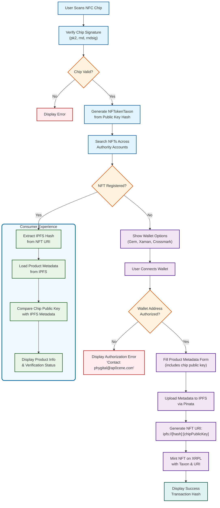

# Ap0cene Authentication Frontend

## Overview

This is a React-based frontend application for Ap0cene Authentication, built with TypeScript.

## 🧬 NFC to NFT Data Flow



## Tech Stack

- React 18.2.0
- TypeScript 4.4.2
- Grommet UI Framework 2.25.0
- XRPL SDK 2.8.1
- React Router DOM 6.14.0
- React Hook Form 7.48.2
- Yup for form validation

## Key Dependencies

- **Wallet Integration**:
  - @crossmarkio/sdk
  - @gemwallet/api
  - xumm
  - xrpl
- **UI Components**:
  - grommet
  - grommet-icons
  - grommet-theme-hpe
  - styled-components
- **Form Handling**:
  - react-hook-form
  - @hookform/resolvers
  - yup
- **HTTP Client**:
  - axios
- **Development Tools**:
  - react-app-rewired
  - eslint
  - prettier
  - typescript

## Application Structure

```
src/
├── components/
│   ├── autoform/      # Form components
│   ├── forms/         # Form-related components
│   ├── home/          # Home page components
│   ├── NavBody.tsx    # Main navigation component
│   └── PageHeader.tsx # Page header component
├── walletUtils/       # Wallet integration utilities
│   ├── crossmark.ts   # Crossmark wallet integration
│   ├── gem.ts         # Gem wallet integration
│   ├── index.ts       # Main wallet utilities
│   └── xaman.ts       # Xaman wallet integration
├── types/             # TypeScript type definitions
├── state/             # State management
├── lib/               # Utility libraries
├── App.tsx            # Main application component
└── index.tsx          # Application entry point
```

## Key Features

1. **Multi-Wallet Support**:

   - Integration with Crossmark
   - Integration with Gem Wallet
   - Integration with Xaman
   - XRPL functionality

2. **UI Framework**:

   - Uses Grommet UI framework
   - Custom theme based on HPE theme
   - Responsive design

3. **Form Handling**:

   - Advanced form validation with Yup
   - React Hook Form integration
   - Autoform components for dynamic forms

4. **Navigation**:
   - React Router DOM for routing
   - Main navigation through NavBody component
   - Page header with consistent layout

## Development

- Development server runs on port 3001
- Uses react-app-rewired for configuration
- Includes ESLint and Prettier for code quality
- TypeScript for type safety

## Build and Deployment

```bash
# Start development server
yarn start

# Build for production
yarn build

# Deploy to Firebase
yarn deploy
```

## Environment

- Node.js environment
- Browser-based crypto operations
- Firebase hosting for deployment

## Security Considerations

- Browser-based crypto operations
- Wallet integration security
- Form validation and sanitization
- Secure API communication

## Future Reference

This documentation serves as a quick reference for understanding the application's structure, dependencies, and key features. For detailed implementation, refer to the specific component files and their documentation.
