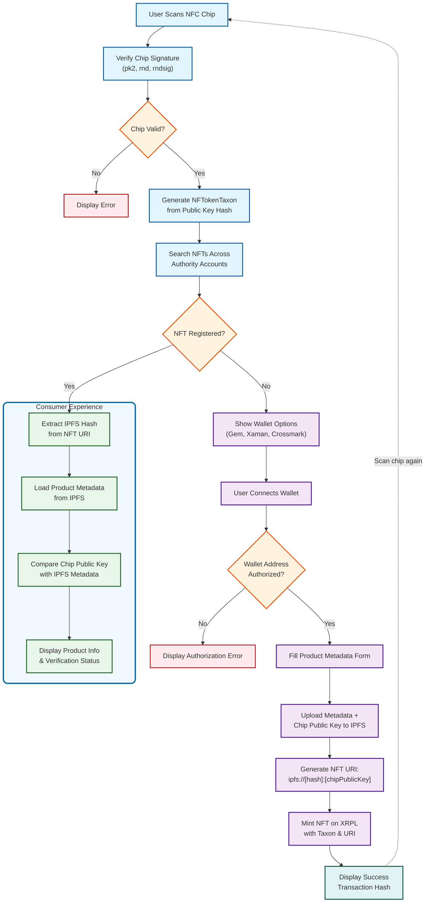

# Ap0cene Phygital NFTs

> **Phygital Authentication Platform** - Bridging the gap between physical products and digital ownership through NFC-enabled blockchain authentication.

## What is Ap0cene?

[Ap0cene](https://apocene.co/) is revolutionizing fashion and product authentication by combining **encrypted NFC chips** with **XRPL blockchain technology**. This frontend application powers the encoding platform where brands and creators can:

- **Register products** by minting NFTs linked to NFC chips
- **Verify authenticity** when consumers scan products
- **Create phygital experiences** that blend physical and digital ownership

Whether you're a luxury brand or an independent creator, our platform makes blockchain-based product authentication accessible to everyone—no coding required, just a smartphone.

## 🔐 How It Works: Authentication Flow



## Core Features

- **🔗 Multi-Wallet Integration**: Seamless connection with Crossmark, Gem Wallet, and Xaman
- **📱 NFC Chip Authentication**: Cryptographic verification of product authenticity
- **🌐 XRPL Blockchain**: Decentralized NFT minting and verification on XRP Ledger
- **📄 IPFS Metadata Storage**: Distributed storage for product information and media
- **✨ No-Code Experience**: Intuitive interface for creators without technical expertise

## Tech Stack

Built with modern web technologies for reliability and performance:

- **Frontend**: React 18 + TypeScript
- **UI Framework**: Grommet with custom theming
- **Blockchain**: XRPL SDK for NFT operations
- **Wallets**: Crossmark, Gem Wallet, Xaman integrations
- **Forms**: Custom form library
- **Storage**: IPFS for decentralized metadata

## Project Structure

```
src/
├── components/
│   ├── autoform/      # Dynamic form components
│   ├── forms/         # Product registration forms
│   ├── home/          # Landing and verification pages
│   └── NavBody.tsx    # Main navigation
├── walletUtils/       # Wallet integration utilities
│   ├── crossmark.ts   # Crossmark wallet
│   ├── gem.ts         # Gem wallet
│   └── xaman.ts       # Xaman wallet
├── types/             # TypeScript definitions
├── state/             # Application state management
└── lib/               # Utility functions
```

## Getting Started

```bash
# Install dependencies
yarn install

# Start development server (runs on port 3001)
yarn start

# Build for production
yarn build

# Deploy to Firebase
yarn deploy
```

## Learn More

- 🌐 **Platform**: [apocene.co](https://apocene.co/)
- 🎥 **How-to Video**: [Watch the tutorial](https://www.youtube.com/watch?v=58755dOkFrA)
